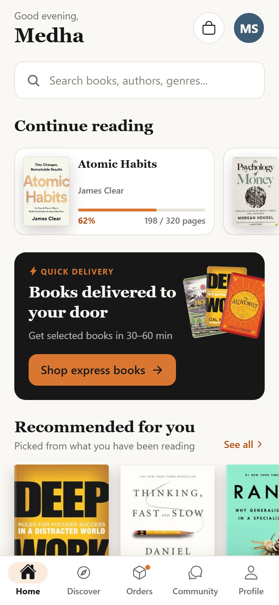
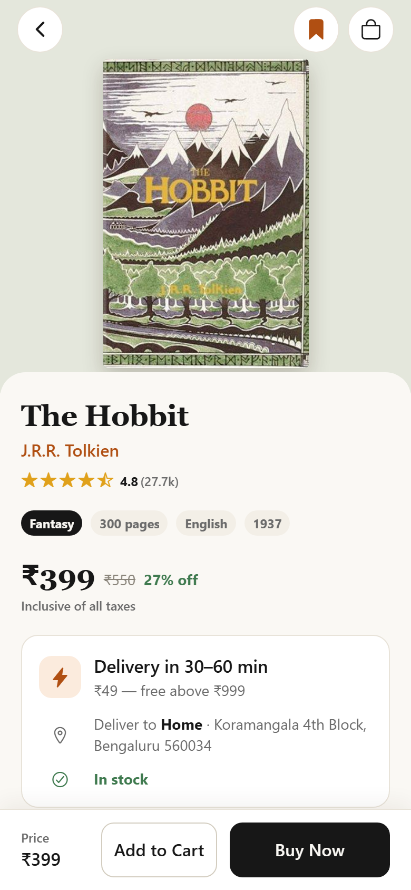
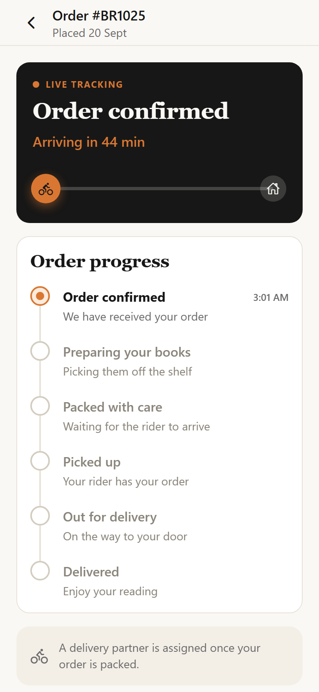
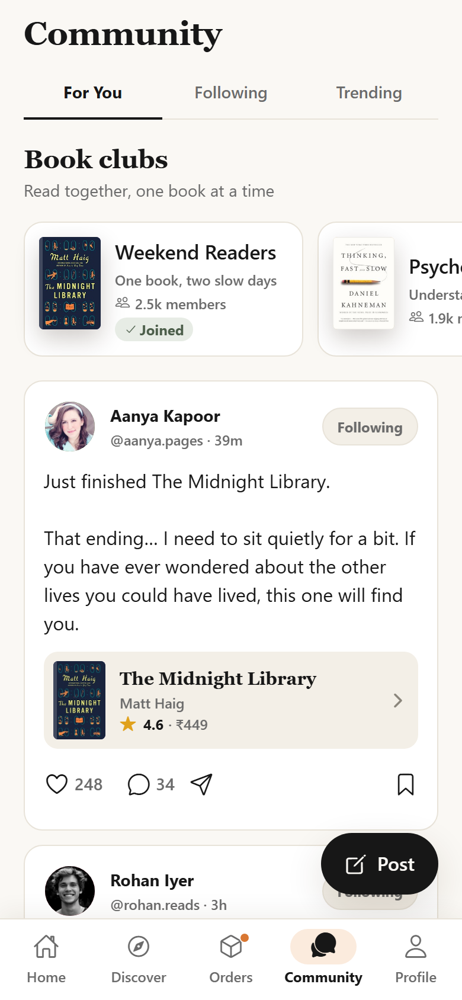

# BookRush

A modern mobile book discovery, commerce and reader community application, built with React Native, Expo and TypeScript.

BookRush tells one story end to end: **discover a book → view beautiful details → add to cart → check out → track the delivery → talk about it with other readers.**

> This is a front-end portfolio project. There is no backend: a typed mock service layer stands in for the API, with realistic latency, loading states and failure modes so every UI state is reachable.

<p align="center">
  
  
  
  
</p>

## Features

- **Authentication** — welcome, login and signup with Zod validation, inline field errors and mocked Apple/Google sign-in.
- **Book discovery** — a curated catalogue with continue-reading progress, recommendations and an editorial trending list.
- **Search** — debounced search with recents, trending queries, category browsing, sorting, filters and grid/list layouts.
- **Book details** — parallax cover, fading header, ratings breakdown, reviews, delivery estimate and a sticky purchase bar.
- **Cart** — quantity stepper, swipe to remove with undo, free-delivery progress and a live order summary.
- **Checkout** — address picker with a validated new-address form, express vs standard delivery, payment selection.
- **Order tracking** — a six-stage timeline with an animated rider, live ETA and a simulated server clock.
- **Community feed** — For You / Following / Trending, animated likes, comments, saves, follows and a post composer.
- **Book clubs** — club detail with the current read, members and a discussion thread.
- **Profile** — shelf, reviews, posts and clubs, plus addresses, payment methods, notifications and settings.
- **Every state covered** — skeletons, empty states, friendly errors with retry, pull-to-refresh and optimistic updates.

## Tech Stack

| Concern        | Choice                                                      |
| -------------- | ----------------------------------------------------------- |
| Framework      | React Native 0.86 + Expo SDK 57                             |
| Language       | TypeScript (strict, `noUncheckedIndexedAccess`, zero `any`) |
| Navigation     | Expo Router (file-based, typed routes)                      |
| Server state   | TanStack Query                                              |
| Client state   | Zustand (+ `persist` via AsyncStorage)                      |
| Forms          | React Hook Form + Zod                                       |
| Animation      | React Native Reanimated 4, Gesture Handler                  |
| Icons / images | `@expo/vector-icons` (Ionicons), `expo-image`               |
| Testing        | Jest + React Native Testing Library                         |
| Tooling        | ESLint, Prettier, GitHub Actions                            |

## Architecture

```text
app/                        # Expo Router routes — thin re-exports of feature screens
  (auth)/                   # welcome · login · signup
  (tabs)/                   # home · discover · orders · community · profile
  books/[id] · cart · checkout · confirmation/[id] · orders/[id] · clubs/[id] · …

src/
  components/
    ui/                     # design-system primitives (Button, Text, BottomSheet, …)
    book/                   # BookCover, BookCard, BookRow, BookRail, Price
    commerce/               # OrderSummary, OptionCard
    feedback/               # AsyncBoundary, ToastHost
    navigation/             # custom animated TabBar
  features/                 # auth · home · discover · books · cart · checkout · orders · community · profile
    <feature>/
      components/           # feature-local UI
      screens/              # screen components
      hooks.ts              # TanStack Query hooks for that domain
  data/                     # curated mock dataset (books, users, posts, clubs, orders)
  services/                 # API-shaped mock layer (authService, bookService, …)
  store/                    # Zustand stores (auth, cart, user, community, search, toast)
  theme/                    # design tokens: colors, spacing, typography, radius, shadows, motion
  hooks/ · utils/ · types/  # shared hooks, pure helpers, domain types
```

A few decisions worth calling out:

**Routes are thin.** Every file in `app/` is a one-line re-export, so navigation structure stays readable and screens remain plain components that are easy to test in isolation.

**Server state and client state are separated.** Anything that would come from an API (books, orders, posts) lives in TanStack Query. Zustand holds only what the client owns: the cart, the session, saved books, likes and follows. Store selectors (`selectCartCount`) keep components subscribed to the narrowest slice they render.

**The mock layer behaves like a network.** Every service call goes through `mockRequest`, which adds latency, can be flipped offline from Settings, and throws a typed `ApiError`. Swapping in a real client means changing one file — nothing above the services layer knows the difference.

**Order tracking is simulated server-side.** `orderService` stores a stage timestamp and catches orders up to where they _should_ be whenever they are read, so progress survives navigation and app restarts. The UI just polls, exactly as it would against a real endpoint.

**Design tokens, not magic values.** Colours, spacing, radii, shadows, typography and spring configs all come from `src/theme`. Components take token names (`color="accentText"`), so the visual language stays consistent and is trivial to retheme.

**Accessibility is part of the component contract.** `IconButton` requires an `accessibilityLabel`, touch targets are at least 44pt, the quantity stepper is an `adjustable` with increment/decrement actions, and Dynamic Type is capped rather than uncapped so dense layouts survive large text.

## Running locally

```bash
git clone https://github.com/itsMedha/bookrush-mobile.git
cd bookrush-mobile
npm install
npx expo start
```

Then press `i` for the iOS simulator, `a` for Android, or scan the QR code with Expo Go. `npm run web` opens it in a browser.

Sign in with any valid-looking credentials — the login screen is pre-filled with demo ones.

### Demo tools

`Profile → Settings` contains two switches for reviewing the app:

- **Simulate network errors** — every request fails, so error and retry states are easy to reach.
- **Reset demo data** — restores orders, cart, likes and posts to their first-run state.

On the tracking screen, orders advance on their own every few seconds; **Skip to next step** jumps ahead.

### Scripts

```bash
npm run validate     # lint + typecheck + tests (what CI runs)
npm run lint         # ESLint, zero warnings allowed
npm run typecheck    # tsc --noEmit
npm test             # Jest
npm run format       # Prettier
```

## Testing

58 tests covering the parts most likely to break:

- **Pure logic** — pricing, discounts, express-delivery eligibility, currency formatting.
- **State** — cart store merging, quantity caps against stock, selectors.
- **Services** — search ranking and filters, pagination, 404s, offline failures, and the order clock (express orders progressing to delivered, standard orders holding at _packed_).
- **Components and flows** — Button states, quantity stepper bounds, book cards, the Add to Cart animation and toast, the cart screen end to end (totals, quantity changes, remove-with-undo), login validation, and post like/save/follow interactions.

## Credits

Cover images are served by [Open Library](https://openlibrary.org/); photography from [Unsplash](https://unsplash.com/). All catalogue data, users, reviews and orders are fictional sample content.

## License

MIT — see [LICENSE](LICENSE).
