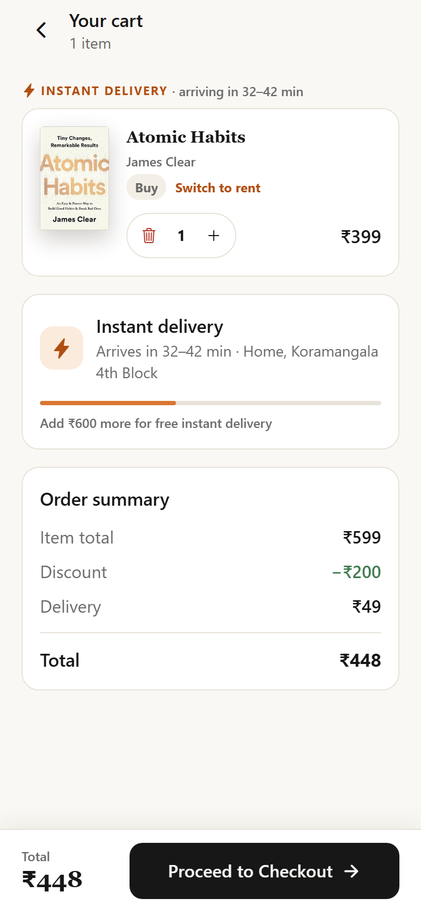

# BookRush

BookRush is a quick-commerce app for books. Find a book, see whether a store near you has it,
buy or rent it, and get it delivered — instantly if it is in stock nearby, or on standard
shipping if it isn't. A reader community sits alongside the shopping experience for working out
what to read next.

Built with React Native, Expo and TypeScript.

<p align="center">
  
  
  
  
</p>

## Features

- Browse and search books by title, author or category
- Per-title delivery availability — instant from a nearby store, standard shipping, or unavailable
- Buy a book or rent it for 30 days
- Cart that groups items by how fast they will arrive
- Checkout with address, delivery speed and payment
- Live order tracking with a delivery timeline
- Order history with one-tap reorder
- Reader community — posts, likes, comments, book clubs

## Tech stack

React Native · Expo · TypeScript · Expo Router · Zustand · TanStack Query ·
React Native Reanimated · React Hook Form · Zod · Jest · React Native Testing Library

## Project structure

```
app/                Routes (Expo Router). Each file re-exports a screen.
src/
  components/       Shared UI — ui/ primitives, books/, commerce/, feedback/
  features/         Feature code: screens, feature components, query hooks
  services/         Data boundary (currently mock) + query client and keys
  stores/           Zustand stores
  data/             Sample catalogue, users, posts, clubs
  theme/            Design tokens
  hooks/ utils/     Shared helpers
  types/            Domain types
docs/               Architecture notes
```

## Architecture

The app is layered: routes → screens → feature components and hooks → state → services → data.
Screens compose components and call hooks; they never call services directly. Anything
server-shaped (books, feed, orders) goes through TanStack Query, while client-owned state (cart,
session, likes) lives in Zustand.

Delivery availability is a first-class part of the book model rather than something discovered
at checkout, so the same badge renders on cards, search results, the detail screen and the cart.

[`docs/frontend-system-design.md`](docs/frontend-system-design.md) covers the detail — the
commerce and community domains and how they connect, how state is split, data flow for the main
screens, the delivery and rental model, how order tracking is simulated, and the trade-offs.

## Running locally

```bash
npm install
npx expo start
```

Then press `i` for the iOS simulator, `a` for Android, or scan the QR code with Expo Go.
`npm run web` runs it in a browser.

The login screen comes pre-filled with demo credentials — any valid-looking email and password
will sign you in.

## Scripts

```bash
npm run lint         # ESLint
npm run typecheck    # tsc --noEmit
npm test             # Jest
npm run validate     # all three, same as CI
```

## Current scope

There is no backend. Data comes from a mock service layer in `src/services` that adds latency
and can be made to fail, so loading, empty and error states are all reachable during
development. The service functions are shaped like API calls, so swapping in a real client means
changing those files and nothing above them.

Stock and delivery are simulated per title in the sample catalogue: some books are held by a
nearby store with their own ETA, some ship standard only, and one is out of stock. Order
tracking advances on a timer inside the order service, and the tracking screen polls for
updates the way it would against a real endpoint.

Two switches in **Profile → Settings** help when trying the app out — one makes every request
fail so you can see the error states, and one resets the demo data.

## Notes

Book covers are fetched from [Open Library](https://openlibrary.org/) and photos come from
[Unsplash](https://unsplash.com/). The catalogue, users, reviews and orders are sample data.

MIT licensed.
